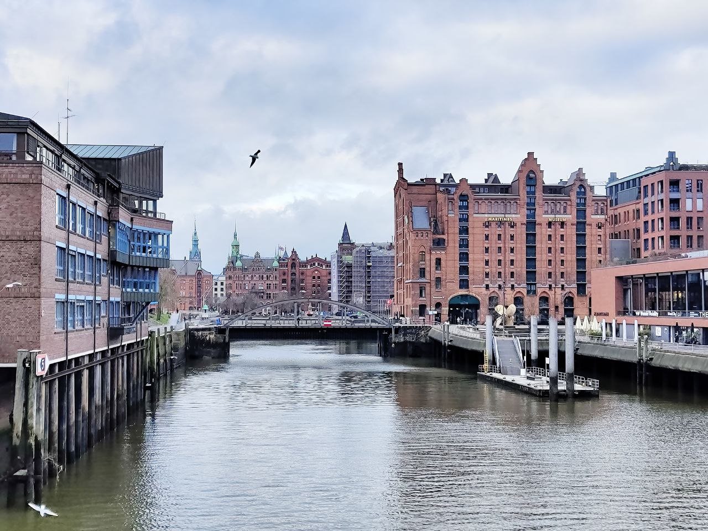

+++
title = 'Из Будапешта в Гамбург с Blue Card за 2 месяца'
slug = 'iz-budapeshta-v-gamburg-s-blue-card-za-2-mesyaca'
date = '2025-03-02T17:11:13+01:00'
draft = false
tags = ['Russian', 'Travel']
+++

Итак, кажется, самая большая глава моего переезда из Венгрии закрыта. Держа заветную немецкую синюю карту в руках, я решил, что пора поделиться моей историей о том, как мы с супругой получили ВНЖ в Германии за 2 месяца. Я понимаю, что кейс звучит не очень сложно, учитывая лояльное отношение Германии к владельцам синей карты в целом (в отличие от Венгрии), но достаточное количество подводных камней побудило меня всё-таки поделиться опытом и, возможно, дать толику уверенности держателям голубой карты других стран ЕС при принятии решения о переезде в Германию. Пожалуй, начнём с вводных.

## Начало

Я работал в Deutsche Telekom 4 года — ещё со времён, когда оперировал офис в Санкт-Петербурге, трава была зеленее, а разговоры о потенциальной возможности военных столкновений под боком провоцировали только сверление виска пальцем. Потом произошли всем известные события в начале 2022 года, и компания решила релоцировать желающих в страны ЕС. Так я, моя жена и кот оказались на просторах Великой Венгрии — в Будапеште.

Уже после приезда моя интенция обязательно заполучить именно EU Blue Card вызывала вопросы у релокационных консультантов, ибо данный документ не имеет практически никаких преимуществ по сравнению с обычным рабочим ВНЖ в Венгрии. Тем не менее мой коронный девиз «лучше перебздеть» заставил пошевелиться меня и окружающих, и в августе 2022 года заветный голубой пластик таки был получен. На тот момент не было ни одной идеи, что с ним делать дальше, но обойдёмся без спойлеров 🙃

## Оффер

Отмотаем время на 2 года вперёд. Проекты меняются один за другим, ощущение финансовой нестабильности и отсутствие возможностей поработать с моим любимым технологическим стеком настроили на мысли о смене места работы, а может, и проживания. Венгрия — отличная страна с кучей возможностей для досуга и общения, но амбиции ассимилироваться и получить гражданство в европейской стране таяли на глазах из-за невероятного языкового барьера и проваленных попыток выйти из русскоязычного пузыря.

Начиная с октября 2024 года я активно начал искать работу в более популярных у релокантов из Восточной Европы странах: Австрии, Германии, Ирландии, Нидерландах. К началу Рождества у меня на руках было два оффера: в Австрию (Вена) и Германию (Гамбург). Можно было бы написать отдельную заметку о процессе поиска работы, но, пожалуй, сфокусируемся на документах 🫠.

Контракт с Deutsche Telekom истекал 31 декабря, и нужно было срочно принимать решение. Оффер в Гамбург оказался объективно заманчивее: как по финансам, так и по техническим задачам в проекте. Решение принято — пора ехать.

## Подготовка

На момент начала Рождества 2024 у меня на руках был подписанный binding offer и драфт рабочего контракта.  Давило также разъяснение релокационной компанией о том, что в Венгрии после окончания контракта у меня будет всего около недели(!) на выдворение своей ~~жопы~~ семьи с Венгерской земли. Поэтому задача - обеспечить максимальную скорость и оперативность процесса переезда и начала работы.

Беглое гугление привело к мысли, что со стажем владения голубой картой в ~2.5 года весь процесс должен быть проще и быстрее. Базовые разъяснения законов и прав при переезде иностранных держателей голубой карты можно найти в [официальной заметке федерального офиса по вопросам миграции Германии](https://www.bamf.de/EN/Themen/MigrationAufenthalt/ZuwandererDrittstaaten/MobilitaetEU/MobilitaetBlaueKarteEU/mobilitaet-blauekarteeu-node.html). Глаз зацепился за данную фразу:

> If you have held an EU Blue Card in another EU member state for at least 12 months, you can travel to Germany visa-free for work and stay there under certain conditions.

Так, это уже что-то. Мне показалось, что звучит даже как-то *слишком* просто, поэтому захотелось разъяснений. На тот момент, пожалуй, не придумалось ничего лучше, чем написать напрямую в [посольство Германии в Будапеште](https://budapest.diplo.de/hu-de) и уточнить те самые "certain conditions". Ответ был такой:

> As you are holding the Hungarian Blue Card for more than two years you and your wife won’t need a visa in advance.
> 
> According to §18i AufenthG i. V. m. §39 (7) AufenthV you can move to Germany and apply for the residence permit at the alien authority within a month.

Появилась уверенность - официальное лицо подтвердило, что можно просто приехать в Германию без визы и податься в течение месяца. Также [запомним ссылку на закон](https://www.gesetze-im-internet.de/aufenthg_2004/__18i.html), которую упомянул консул - он нам еще понадобится. Едем в Гамбург!

## Переезд (частичный)

К нашему великому удивлению из Будапешта ходит регулярный десятичасовой поезд в Гамбург. Самолет не рассматривали, так как едем с котиком и лучше я отсижу себе задницу чем буду слушать щемящий сердце скулёж на взлете и посадке. Приятно также, что MAV (Венгерские железные дороги) позволяет перевозить небольших животных в переноске без дополнительной оплаты и оповещения 🐱

Вопрос жилья был временно закрыт бронью Airbnb на первые 2 недели. Тут закралась первая *ошибка*, о которой я упомяну позднее. Билеты куплены, бронь подтверждена, пора ехать!

Во время выездной волокиты я активно переписывался с [Hamburg Welcome Center](https://welcome.hamburg.de/). Это организация, которая является неким "фронтендом" для миграционного офиса в Гамбурге (Ausländerbehörde). Направили сразу на подачу с помощью [онлайн-формы](https://serviceportal.hamburg.de/HamburgGateway/Service/Entry/AFM_Auf_en/), но своего кейса в шагах я так и не нашел, на что указал в ответном письме. Отвечают вдумчиво, но долго, поэтому через пару дней после приезда мы направились к ним. К счастью, их ресепшн работает каждый рабочий день и принимает без записи. Получили следующую информацию:

* [Список документов для подачи на синюю карту](https://welcome.hamburg.com/resource/blob/835126/6a5570d465eb67aeb6e3c1c21c401986/checklist-employment-eu-blue-card-data.pdf)
* [Список документов для подачи на воссоединение семьи](https://welcome.hamburg.com/resource/blob/835128/951dbceb0bcc28178aca09d9ec85dbd2/checklist-family-reunification-data.pdf)
* Почта, куда можно послать документы вместо онлайн-формы: professionals@welcome.hamburg.de

Документы на языке отличном от немецкого необходимо перевести с помощью бюро. Переводчик должен быть сертифицирован для осуществления перевода официальных документов. Контор, которые этим занимаются немало, я выбрал [FÜD](https://www.fachuebersetzungsdienst.com/en/), так как можно подать документы онлайн и оригинал перевода довольно оперативно высылают на почту (бумажную и электронную).

Тут мы получили свой первый "головняк" — *апостиль*.

## Апостили

Я решил выделить эту тему в отдельную секцию, так как апостили являются камнем преткновения для многих проживающих за рубежом. Если вам повезло не знать что это такое - я вам завидую.

Вкратце о том, что такое Гаагский апостиль можно прочесть [тут](https://germania.diplo.de/ru-ru/service/08-beglaubigungen/apostille-1261202).

В нашем случае главной проблемой оказалось отсутствие апостиля на свидетельстве о браке, выданном в Санкт-Петербурге. Как оказалось, существует [двустороннее соглашение Венгрии и СССР о взаимном признании официальных документов](https://www.mid.ru/ru/foreign_policy/international_contracts/international_contracts/2_contract/53103/), которое всё еще имеет юридическую силу. Следовательно, никто не озаботил нас этим вопросом во время релокации в Будапешт, что сыграло злую шутку в подаче документов в Гамбурге. Изрядно понервничав, мы решили срочно попросить родственников в РФ с генеральной доверенностью (спасибо правилу "лучше перебздеть") сделать дубликат свидетельства по истребованию.

Смогли срочно получить дубликат с апостилем за пару дней. Отправили компанией [Time Saving Machine](https://timesavingmachine.ru/), получили апостилированное свидетельство через ~5 дней из Москвы. Дорого, но оперативно!

## Регистрация в Гамбурге

Одно из требований при отправке документов это получение городской регистрации в Гамбурге после прибытия (Anmeldung). Это обязательная процедура не только для свежеприбывших в Германию, но и для рядовых немцев при переезде из одного жилья в другое. Помните я упомянул про ошибку с Airbnb? Так вот - чтобы зарегистрироваться нужен сертификат от лендлорда, подтверждающий ваше пребывание в жилье (Wohnungsgeberbestätigung 💀). Бумага должна содержать ваше имя и имя супруга при наличии оного. К сожалению, Airbnb позиционирует себя как туристическое предприятие, соответственно, даже при брони на продолжительный срок они не предлагают получение данного документа.

Следовательно, настоятельно рекомендую заранее найти мебелированое краткосрочное жилье перед поездкой. Существуют сервисы, которые предлагают подобные квартиры/номера на срок от 3 до 6 месяцев с предоставлением сертификата. Мы нашли номер в апартотеле с контрактом на 3 месяца на [Homelike](https://www.thehomelike.com/), в поиске можно сразу отфильтровать квартиры по услуге предоставления "certificate of residence".

Также следует учесть, что на регистрацию вы **обязаны** подать в течение двух недель после заселения. Записаться также можно онлайн, описание можно найти в [данной замечательной статье](https://housinganywhere.com/Hamburg--Germany/registration-in-hamburg).

## Законы и получение встречи в миграционке

Так как Hamburg Welcome Center является лишь фасадом для миграционного офиса, они не вправе принимать решения, консультировать по миграционным законам и назначать встречу в миграционном офисе. Таким образом образовался вопрос - могу ли я уже начать работать пока моё заявление рассматривает миграционная служба? Ответ на этот вопрос потребовал длительных обсуждений законодательства с [офисом разъяснения миграционного законодательства](https://welcome.hamburg.com/legal-counseling-18102) (перевод вольный). С ними можно связаться напрямую через почту (auslaenderrecht@welcome.hamburg.de), чем я и занялся. Сначала подготовил почву для обсуждений в виде законов, которые, по моему мнению, подходили под мой случай:
- секция о долгосрочной мобильности владельцев EU Blue Card: [§ 18i Langfristige Mobilität für Inhaber einer Blauen Karte EU](https://www.gesetze-im-internet.de/aufenthg_2004/__18i.html)
- секция с общими требованиями получения синей карты: [§ 18g Blaue Karte EU](https://www.gesetze-im-internet.de/aufenthg_2004/__18g.html)
- параграф 6а секции о правилах подачи на ВНЖ: [§ 81 Beantragung des Aufenthaltstitels](https://www.gesetze-im-internet.de/aufenthg_2004/__81.html)

Это необходимо было сделать, так как в Германии происходили [изменения законов, касающихся мобильности в 2023 году](https://www.make-it-in-germany.com/en/visa-residence/skilled-immigration-act) и я из раза в раз встречался с неосведомленностью госслужащих миграционной службы(!) об этих изменениях и законов о синей карте в целом.

Какие выводы я сделал из данных секций (не является юридически правильным толкованием)?
1. При владении синей картой более 12 месяцев есть право просто приехать в Германию без визы и подать на смену синей карты на немецкую (при наличии рабочего контракта или подписанного оффера)
2. При владении картой более 2 лет требование о подтверждающей квалификации считать выполненным
3. Если вы подаёте на синюю карту имея блю кард другой страны ЕС, то решение о выдаче немецкой карты должно быть принято не более чем через 30 дней после подачи заявления вами. Если этого не произойдет, то вы в праве начать работать через 30 дней.

Данные выводы я и решил провалидировать. Офис ответил так (прямые цитаты из почты, сократил вырезки из законов):

> There are two types of mobility: short-term mobility with the Blue Card and long-term mobility
> 
> **Short-term mobility**
> 
> Blue Card holders from other EU countries may come to Germany for a stay of up to 90 days within a period of 180 days for the purpose of business activities directly related to their employment. For this short-term stay, neither a visa nor a work permit from the BA is required.
> 
> This means that if you are supposed to work in Germany for a maximum of 90 days within the scope of the employment contract on the basis of which you received the Blue Card in Hungary, you do not need a visa or a work permit in Germany.
> 
> ...
> 
> **Long-term mobility**
> 
> After a minimum stay of 12 months in another EU country with an EU Blue Card, it is possible to relocate to Germany permanently without a visa. As a rule, people who wish to reside and work here on a long-term basis require a visa to enter the country.
> 
> After entry (within one month, § 39 para. 7 AufenthV), an application for a German EU Blue Card must be submitted to the immigration authorities. This is usually granted if the requirements of § 18g AufenthG are met.

Отлично! Первый и второй пункты, кажется, соответствуют действительности. Что насчет третьего?

> According to Section 81 6a of the Residence Act, he should receive a temporary residence permit and a work permit within 30 days of submitting the **complete application**. However, the 30-day period can be extended. He is not allowed to work without the permit.
> 
> I have already written to the colleagues responsible and pointed out the urgency.
> 
> Excerpt from Section 81 6 a of the Residence Act:
> 
> ...
> 
> The fourth sentence means that the applicant may exercise the employment for which he has applied for the EU Blue Card no later than 30 days after the date of submission of the complete application – and thus the notification of the provisional residence permit – even if the application has not yet been decided. However, a permit to exercise the profession must be available for this, insofar as this is required.

Замечательно. Кажется третий пункт тоже можно приложить к моему кейсу, что лишний раз подтвердилось получением уведомление о назначении встречи в миграцонном офисе через неделю. Это большое дело - обычно срок ожидания назначения может составлять месяцы.

Подведем промежуточный итог:
- 3го января мы прибыли в Гамбург
- 20го января мы послали все документы для подачи на почту миграционного офиса
- На 10 февраля был назначен "Termin" (встреча) с целью получения ВНЖ мне и моей супруге

## Termin в миграционном офисе

С этого момента все стало довольно просто и предсказуемо. Приходим в миграционный офис (который располагается на соседнем этаже от ресепшена Welcome Center), ждем своего номера на табло и выдвигаемся в кабинет. Стоит отметить, что в нашем случае сотрудник, занимающийся нашим кейсом заранее забрал паспорта и подозвал нас лишь через час. Вновь услышав, что такой случай у них первый и недавно меняли законы, я принялся объяснять то, что описал в предыдущей секции. Сотрудник лишний раз подтвердил правильность понимания законов и заявил, что всё одобрено. На руки выдали бумажку под названием "fiktionsbescheinigung" - временное подтверждение разрешения на работу, пока не выдадут пластик. Супруга данной бумаги не получила, но мы и не просили 🤔

Стоимость пошлины на выдачу документа - 100 евро на человека. Оплату производил переводом по IBAN с указанием номера кейса и своего имени в референсе. Также предложили так называемую "экспресс" выдачу пластика - доплачиваем по 30 евро на человека и обычные 4-6 недель ожидания пластика сокращаются до двух. По рукам!

На следующий день довольный иду на onboarding в офис 🥳

## Получение пластика

Спустя 2.5 недели на почту мне и супруге пришли уведомления, что пластик готов, приходите. К счастью, для выдачи Termin не нужен, можно просто подойти по часам работы миграционки и показать уведомление на ресепшене. Спустя **час** (понимаю, но дайте отдохнуть, они и так отправили email вместо бумажного письма...) нам выдали заветные пластиковые карты.

## Итоги и дальнейшие трудности

Таким образом, за ~2 месяца от приезда в Гамбург у нас на руках оказались EU Blue Card и ВНЖ по воссоединению семьи. Учитывая классическую немецкую бюрократию, считаю, что такой небольшой срок получения можно уже считать достижением. Стоит упомнянуть, что многие знакомые, проживающие в Германии достаточное время, подтвердили заметное улучшение процессов работы с документами.

Конечно, остались и другие нерешенные (или *почти* решенные) проблемы: поиск квартиры, открытие банковского счета, подача налоговой документации... Тем не менее, получение ВНЖ это та самая база, которая позволит разрешить все остальные проволоки.

Также я не упомянул получение медицинской страховки - в списке документов на подачу она присутствует. Но процесс достаточно тривиальный сам по себе - при наличии рабочего контракта достаточно податься в выбранную государственную или частную страховку с паспортом и, при наличии супруга, свидетельством о браке. Я выбрал [Techniker Krankenkasse](https://www.tk.de/techniker).

Пара дополнительных советов:
- Не бойтесь указывать сотрудникам на законы и спрашивать о своем понимании их. В миграционном офисе тоже работают люди, зачастую не обладающие энциклопедическими знаниями
- Не бойтесь "наглеть" и писать на почту по каждой мелочи, звонить и задавать вопросы. Как правило, это поможет ускорить процесс.
- Сохраняйте **все** бумаги полученные по почте и от сотрудников офиса. Многие номера и идентификаторы приходят по бумажной почте в единственном экземпляре и перевыдача занимает время.

Также я не упомянул о некоторых деталях, которые не совсем вписываются в формат данной заметки. Думаю, будет проще ответить на вопросы читающих напрямую 💬

Спасибо за помощь и поддержку моим новым работодателям, моей прекрасной супруге и коту!

Отвечу на любые вопросы в [телеграме](https://t.me/gren236) или [по почте](mailto:gren236@gmail.com). Пишите!

P.S. Для тех кто осилил много букв, вот фото нашего котика:



